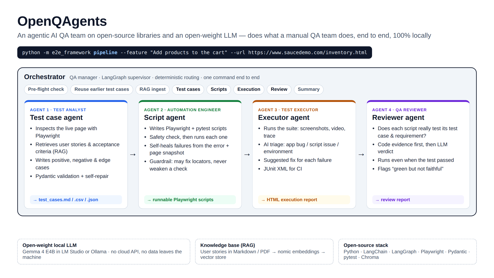
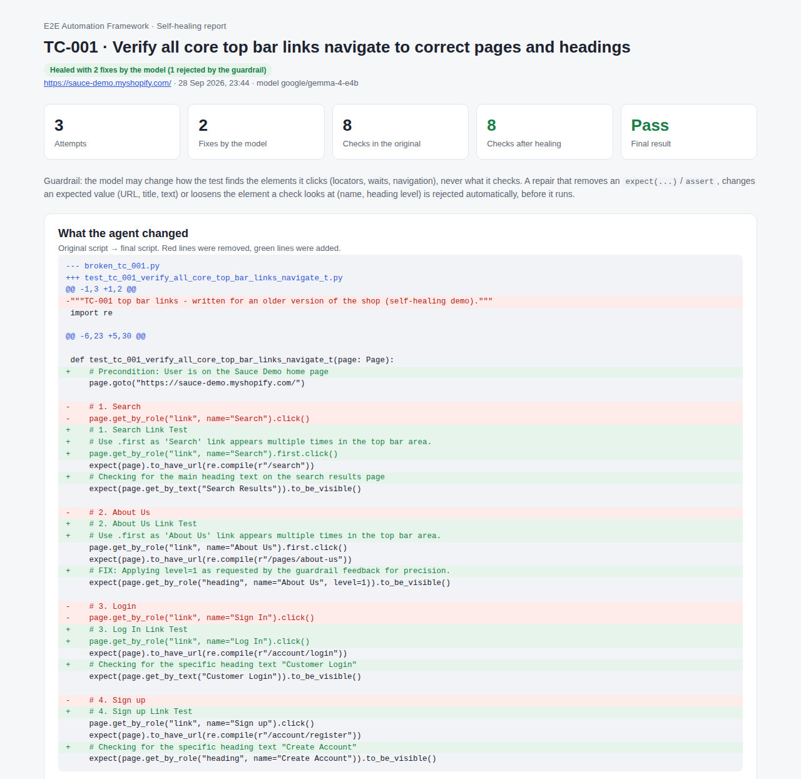
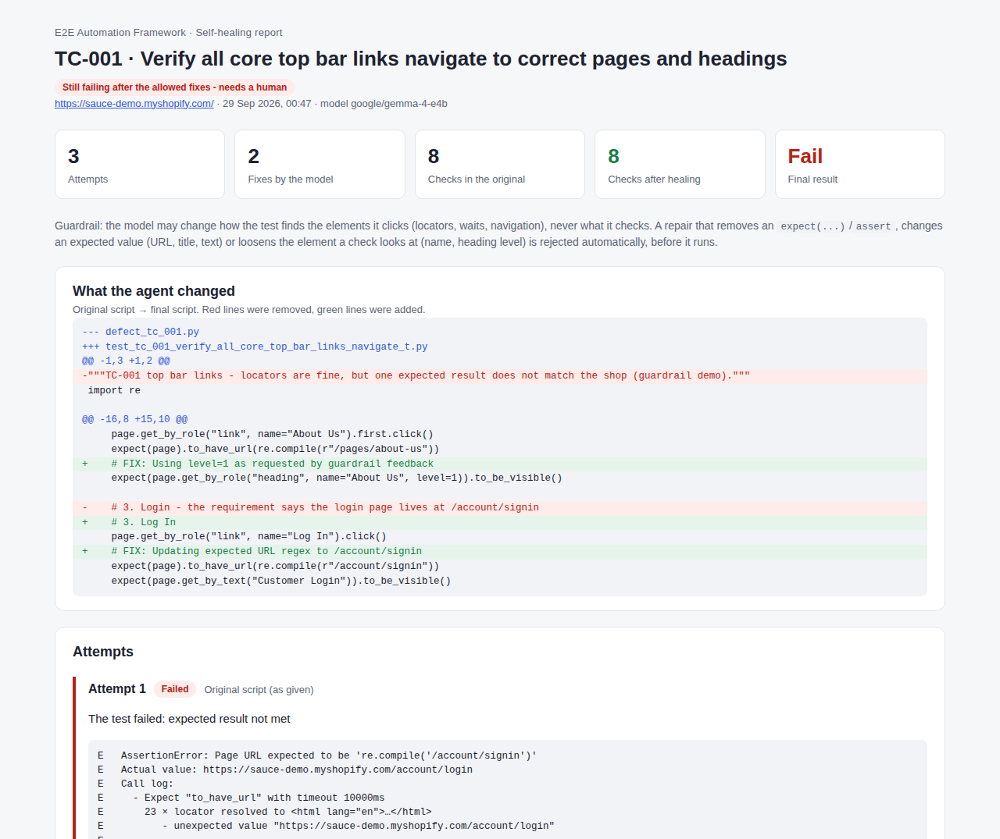
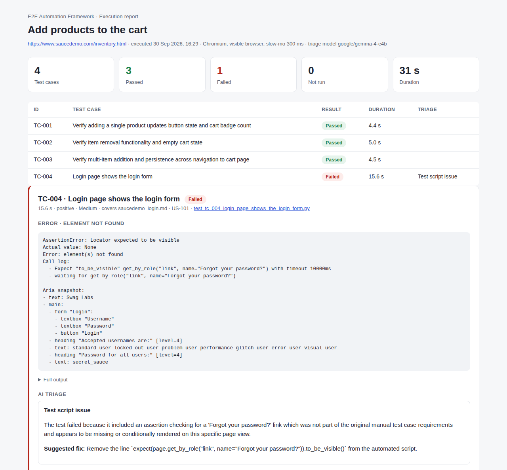
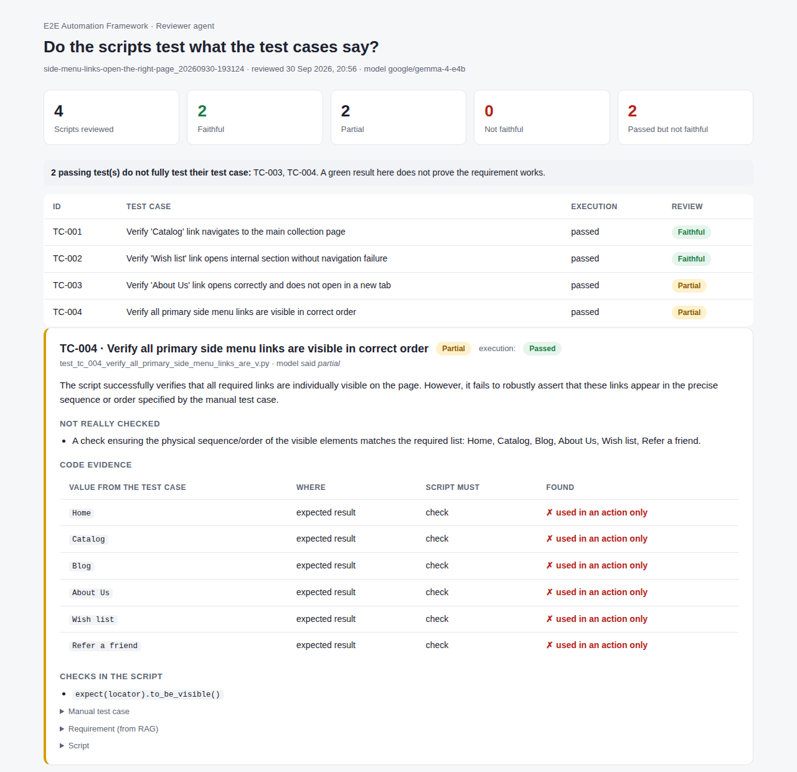

# OpenQAgents

**An agentic AI QA team built on open-source libraries and an open-weight LLM. It does what a manual QA team does, end to end: reads the user story, designs the test cases, automates them, runs them, triages the failures and reviews the results. Everything runs locally.**


-4285F4)


> 🔒 **The source code is private.** This repository is the overview. To see the code,
> [request read-only access](../../issues/new?template=request-access.yml). I review every request personally.



## One command, end to end

```powershell
python -m e2e_framework pipeline --feature "Add products to the cart" --url https://www.saucedemo.com/inventory.html --open
```

The orchestrator then runs:

1. **Pre-flight**: checks that LM Studio is running and the chat and embedding models are available. If not, it stops early with a fix-it message.
2. **Reuse check**: if test cases for this feature already exist, it skips straight to scripts or execution.
3. **RAG ingest**: loads the user stories and acceptance criteria into a Chroma vector store.
4. **Test cases**: writes manual test cases grounded in the requirements and the live page.
5. **Scripts**: writes Playwright + pytest scripts, runs each one and self-heals it if needed.
6. **Execution**: runs the suite with screenshots, video and traces, AI triage and an HTML report.
7. **Review**: checks that every script tests what its test case says, even when it passed.

## Your QA team, as agents

| QA team role | Agent | What it does |
|---|---|---|
| **QA manager** | Orchestrator | LangGraph supervisor that runs the pipeline above from one command. Routing is rule-based and predictable. |
| **Test analyst / designer** | 1. Test case agent | Inspects the page with Playwright, retrieves the matching user stories (RAG) and writes positive, negative and edge test cases. Output is validated with Pydantic and repaired if invalid. |
| **Automation engineer** | 2. Script agent | Turns each test case into a Playwright script, checks it, runs it and **self-heals** failures from the error and a snapshot of the page. |
| **Test executor / defect triage** | 3. Executor agent | Runs the suite and labels each failure as an **app bug, test script issue or environment problem** with a suggested fix, then writes an HTML report. |
| **QA lead / reviewer** | 4. Reviewer agent | A passing test can still test the wrong thing. It compares each script with its manual test case and requirement: code evidence first, then an LLM verdict. |

## Highlights

- **Grounded, not guessed.** Each test case cites the user story and acceptance criterion it covers, and uses the real page's elements and locators.
- **Self-healing with guardrails.** The model may change *how* a test finds an element (locators, waits, navigation), never *what* it checks. A fix that removes an assertion, changes an expected URL, title or text, or loosens a check is rejected automatically, so a real defect stays red.
- **AI triage.** Failures are classified using the error plus the visible elements at the moment of failure.
- **A reviewer for green tests.** It flags passing scripts that don't fully test their test case.
- **Open-source stack, open-weight model, fully local.** LangChain, LangGraph, Playwright, Chroma and pytest, with Gemma 4 E4B running in LM Studio or Ollama. No cloud API; nothing leaves the machine.
- **Tested.** 55 unit tests run offline with a fake LLM and a local mock shop.

## Screenshots

### Self-healing: a broken script repaired, one unsafe fix rejected



### Guardrail: a real mismatch stays red

The requirement says the login page is at `/account/signin`, but the shop uses `/account/login`. The healer is not allowed to change the expected URL, so the test keeps failing and is handed to a human.



### Execution report with AI triage

A deliberately wrong check (a "Forgot your password?" link that doesn't exist) is triaged as a *test script issue*, not an app bug.



### Reviewer: "passed" is not the same as "tested"

All four side-menu tests passed. The reviewer flagged two of them; for example, TC-004 checks that every link is visible but never checks their order.



## Results from real runs

| Feature | Site | Outcome |
|---|---|---|
| Add products to the cart | saucedemo.com | 4/4 passed. A deliberately broken 4th case was triaged as a test script issue, and the guardrail stopped the healer from deleting the check. |
| Side menu links | sauce-demo.myshopify.com | 4/4 passed. The reviewer flagged 2 passing tests as only partly testing their test case. |
| Top bar links (self-healing demo) | sauce-demo.myshopify.com | Broken script healed in 3 attempts; 1 unsafe fix rejected by the guardrail. |

## Tech stack

Python · LangChain (prompts, tools, output parsing) · LangGraph (one state graph per agent plus the orchestrator) · Playwright (page inspection and generated tests) · pytest · Pydantic · Chroma · LM Studio / Ollama · Gemma 4 E4B · nomic-embed-text

## Design decisions

- **Rule-based routing, LLM where it adds value.** The orchestrator decides the next step with rules; the model writes, fixes, triages and reviews. A 4B local model isn't a reliable planner, so each agent is a fixed graph with bounded retry loops.
- **Validate everything the model returns.** Pydantic schemas and a repair loop for test cases, triage results and reviews.
- **Give the model the page, not just the error.** On failure the framework saves the visible elements at that moment, and the healer and triage use them.
- **Safe re-runs.** The vector index is only replaced after a test embedding succeeds, so a failed ingest never empties the knowledge base.

## What I learned

- A green test isn't proof. The reviewer exists because passing scripts sometimes check less than the test case asks.
- Most "hallucinations" were bad context. Debug retrieval first.
- Guardrails belong in code, not only in the prompt.
- Local models have their own quirks: models get unloaded, context windows are small, and a pre-flight check saves a lot of time.
- AI takes over the repetitive work. Deciding whether a failure is a real defect is still a QA decision.

## Next steps

- Reviewer: follow expected values through variables and loops, and flag locators that aren't scoped to the right section (for example side menu vs top bar).
- Human-approved fix agent: turn a "test script issue" triage into a proposed fix that is applied only after approval.
- Jira stories and Excel test data as inputs.

## Get the code

1. [Open an access request](../../issues/new?template=request-access.yml) with your GitHub username.
2. I review it.
3. If approved, you get a GitHub invitation with **read-only** access to the private repository.

Requests are public GitHub issues, so please don't include an email address or phone number.
